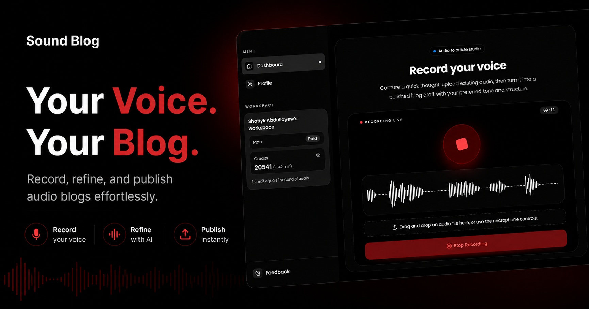

# 🎙️ Sound Blog

Sound Blog turns voice recordings or uploaded audio files into structured blog posts. Record your audio in the browser, drop an audio file, apply generation preferences, track processing status, edit the generated article, and manage your recordings from a private dashboard.

<!-- <p align="center">
  <a href="https://sound-blog.com" target="_blank"></a>
</p> -->

## ✨ Features

- 🎙️ Browser voice recording with waveform preview.
- 📁 Audio file drag-and-drop upload.
- 🎛️ Generation filters for tone, length, and article enhancements.
- 🔐 Private dashboard for your recordings, profile, credits, and generated articles.
- 📖 Generated blog reader with markdown rendering.
- 📝 Markdown editor for updating generated articles.
- 🔍 Raw transcript and original audio playback view.
- 🔊 Text-to-speech generation for blog content.
- 💳 Credit tracking and paid plan checkout.

## 🛠️ Tech Stack

- **Framework:** Next.js App Router, TypeScript
- **Styling:** Tailwind CSS, ShadCN
- **CMS / Data:** Payload CMS, MongoDB adapter
- **Auth:** Supabase Auth
- **Storage:** Cloudflare R2 via AWS S3 SDK
- **Payments:** Stripe Embedded Checkout
- **Data fetching:** TanStack Query
- **Audio:** Wavesurfer.js
- **Editor / Markdown:** `@uiw/react-md-editor`, `react-markdown`

## 🗺️ Main Routes

- `/` - public landing page
- `/pricing` - subscription plans
- `/sign-in`, `/sign-up` - authentication pages
- `/dashboard` - authenticated recording dashboard
- `/profile` - user plan, credits, and invoices
- `/record/[id]` - generated article, transcript, audio, and editor
- `/admin` - admin panel

## 📁 Project Structure

```txt
src/app/(frontend)       Public and dashboard UI routes
src/app/(payload)        Payload CMS config, admin, collections, API bridge
src/app/api              App-specific API routes
src/components           Shared UI and feature components
src/hooks                Client hooks for auth, TTS, and recording
src/lib                  Supabase, Stripe, utilities, constants
src/services             TanStack Query service hooks
```

## 🔐 Environment Variables

Copy `.env.example` to `.env` and fill in the values for your services.

```bash
cp .env.example .env
```

Required groups:

- `DATABASE_URI`, `PAYLOAD_SECRET` for Payload CMS.
- `NEXT_PUBLIC_SUPABASE_URL`, `NEXT_PUBLIC_SUPABASE_ANON_KEY` for Supabase auth.
- `R2_ACCESS_KEY_ID`, `R2_SECRET_ACCESS_KEY`, `R2_ENDPOINT_URL`, `R2_PUBLIC_URL`, `R2_VOICE_RECORD_BUCKET` for Cloudflare R2.
- `NEXT_PUBLIC_APP_URL` for redirects and Stripe return URLs.
- Stripe keys and price IDs for checkout.

## 🚀 Getting Started

Install dependencies:

```bash
pnpm install
```

Run the development server:

```bash
pnpm dev
```

Open `http://localhost:3000`.

Generate Payload types/import map when Payload collections change:

## ⚙️ How It Works

1. 👤 A user signs in to the platform.
2. 🎙️ The dashboard records audio or accepts an uploaded audio file.
3. 🧠 The audio is processed to generate an accurate transcript and a well-structured blog post.
4. 📊 The dashboard displays the processing status and the final generated articles.
5. ✍️ Users can edit markdown content, copy it, view the raw transcript, and generate TTS audio.
6. 💳 Users can manage their credits, subscription plans, and account settings.

## 📈 Status

This is an active project. Some production concerns, such as private/signed audio URLs, webhook hardening, and server-side audio duration calculation, may still need additional work depending on deployment requirements.

## 🤝 Contributing

Contributions are highly appreciated! We welcome suggestions, bug reports, and pull requests from everyone. Read more about contribution [here](./CONTRIBUTING.md).

### What You Can Contribute

- **Bug Fixes:** Notice something broken? Open an issue or submit a PR to fix it!
- **New Features:** Have a great idea for a new feature? We'd love to hear it.
- **Documentation:** Improvements to this README or other docs are always welcome.
- **UI/UX Enhancements:** Suggestions for improving the design and user experience.

### How to Open a PR

1. **Fork the repository** to your own GitHub account.
2. **Clone the project** to your local machine.
3. **Create a branch** for your feature or bug fix (`git checkout -b feature/my-awesome-feature`).
4. **Make your changes** and commit them clearly (`git commit -m 'feat: add some feature'`).
5. **Push to the branch** on your fork (`git push origin feature/my-awesome-feature`).
6. **Open a Pull Request** against the main branch of this repository.

Please make sure to read our contribution docs (if available) for more detailed information before contributing.
